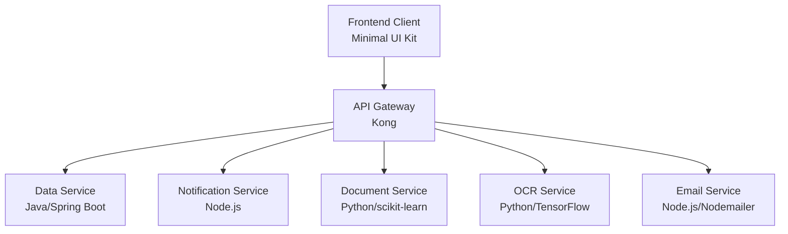

# Kong API Gateway for MCA Application Processing System

## Overview

This directory contains the configuration and deployment files for the Kong API Gateway (version 3.5.0), which serves as the unified entry point for all API requests in the Merchant Cash Advance (MCA) Application Processing System. The gateway provides consistent security controls, request routing, and monitoring across all microservices.

## Gateway Role in System Architecture

The Kong API Gateway serves as the primary security boundary for all external requests, implementing multiple layers of protection:



Key responsibilities include:

- **Unified Entry Point**: All frontend requests pass through the gateway before reaching backend services
- **Security Controls**: Centralized authentication, authorization, and rate limiting
- **Request Routing**: Dynamic routing to appropriate microservices
- **Monitoring**: Request logging and performance tracking
- **Cross-Cutting Concerns**: CORS, request/response transformation, and error handling

## Security Features

### JWT Authentication

The gateway implements JWT-based authentication with the following parameters:

- **Algorithm**: RS256 (asymmetric key signing)
- **Token Expiry**: 60 minutes
- **Refresh Token**: 7 days

JWT validation includes token expiration, issuer validation, and audience verification to prevent token forgery or replay attacks.

### Role-Based Access Control

The gateway enforces role-based permissions for two specific roles:

- **Operations Staff**: Read all, write application data
- **System Admin**: Full access to all endpoints and webhook configuration

### Rate Limiting

Tiered rate limiting is enforced with the following default limits:

- Authenticated users: 60 requests per minute
- Unauthenticated requests: 10 requests per minute

Rate limits are stored in Redis to ensure consistent enforcement across multiple gateway instances.

### CORS Policies

Strict Cross-Origin Resource Sharing policies are configured with explicit allowed origins, methods, and headers. Pre-flight request caching is optimized for performance while maintaining security boundaries.

### IP Restriction

Configurable IP-based access controls for administrative endpoints with allowlist functionality and audit logging of blocked requests.

## Directory Structure

```
api-gateway/
├── config/                  # Kong configuration files
│   ├── kong.yml            # Declarative configuration file
│   ├── jwt-keys/           # JWT public/private keys
│   └── README.md           # Configuration documentation
├── docker-compose.yml      # Local development setup
├── Dockerfile              # Container definition
└── README.md               # This file
```

## Local Development

### Prerequisites

- Docker and Docker Compose
- Git
- curl (for testing)

### Starting the Gateway

```bash
# Clone the repository (if not already done)
git clone <repository-url>
cd api-gateway

# Start the Kong API Gateway and its dependencies
docker-compose up -d

# Check if the services are running
docker-compose ps

# Check the Kong status
curl http://localhost:8001/status
```

### Testing the Gateway

```bash
# Test a route (replace with an actual route)
curl -i http://localhost:8000/api/v1/applications

# Test with a JWT token
curl -i -H "Authorization: Bearer <your-jwt-token>" http://localhost:8000/api/v1/applications
```

## Deployment

### Production Deployment

For production deployment, the Kong API Gateway is deployed as part of the Kubernetes infrastructure:

```bash
# Apply Kubernetes configuration
kubectl apply -f infrastructure/kubernetes/charts/api-gateway/templates/

# Check deployment status
kubectl get pods -n api-gateway
```

### Configuration Updates

To update the Kong configuration:

1. Edit the declarative configuration file (`config/kong.yml`)
2. Validate the configuration:
   ```bash
   kong config parse ./config/kong.yml
   ```
3. Apply the configuration:
   ```bash
   # For local development
   curl -X POST http://localhost:8001/config -F config=@config/kong.yml
   
   # For production (via Kubernetes)
   kubectl apply -f infrastructure/kubernetes/charts/api-gateway/templates/configmap.yaml
   ```

## API Routes

The gateway exposes the following API routes:

- `/api/v1/applications`: Application management endpoints
- `/api/v1/documents`: Document operations endpoints
- `/api/v1/webhooks`: Webhook configuration endpoints

All routes require JWT authentication except for the authentication endpoints.

## Troubleshooting

### Common Issues

1. **JWT Authentication Failures**:
   - Check token expiration
   - Verify the correct public key is being used
   - Ensure the token contains the required claims (iss, aud, exp)

2. **Rate Limiting Issues**:
   - Verify Redis connection
   - Check rate limit configuration
   - Examine rate limit headers in responses

3. **CORS Errors**:
   - Confirm the origin is in the allowed list
   - Check that the required methods and headers are permitted
   - Verify pre-flight requests are being handled correctly

### Logs and Monitoring

Kong logs are available at the following locations:

- **Local Development**: `docker-compose logs kong`
- **Production**: `kubectl logs -n api-gateway <pod-name>`

For detailed troubleshooting, increase the log level in `kong.conf` or via environment variables:

```
KONG_LOG_LEVEL=debug  # Options: debug, info, notice, warn, error, crit
```

## References

- [Kong Documentation](https://docs.konghq.com/gateway/latest/)
- [Kong Declarative Configuration Format](https://docs.konghq.com/gateway/latest/reference/db-less-and-declarative-config/)
- [Kong JWT Plugin](https://docs.konghq.com/hub/kong-inc/jwt/)
- [Kong Rate Limiting Plugin](https://docs.konghq.com/hub/kong-inc/rate-limiting/)
- [Kong CORS Plugin](https://docs.konghq.com/hub/kong-inc/cors/)