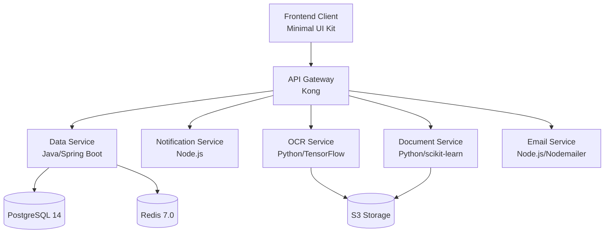

# Kong API Gateway for MCA Application Processing System

## Overview

This directory contains the configuration for the Kong API Gateway, which serves as the unified entry point for all API requests in the Merchant Cash Advance (MCA) Application Processing System. The gateway provides consistent security controls, request routing, and monitoring for the entire microservice architecture.


## Purpose and Role

The Kong API Gateway serves as the primary security boundary for all external requests, implementing multiple layers of protection while routing traffic to the appropriate microservices. Key responsibilities include:

- **Unified API Access**: Provides a single entry point for all frontend-to-backend communication
- **Security Controls**: Implements JWT authentication, rate limiting, and IP filtering
- **Request Routing**: Routes requests to appropriate microservices based on URL patterns
- **Traffic Management**: Controls and monitors API traffic flow
- **Cross-Origin Resource Sharing**: Manages CORS policies for secure cross-origin requests
- **Request/Response Transformation**: Modifies requests and responses for security and compatibility

## Integration with MCA System

The Kong API Gateway integrates with the following MCA system components:



## Security Features

### JWT Authentication

The gateway implements JWT authentication with the following configuration:

- **Algorithm**: RS256 (asymmetric encryption with 2048-bit keys)
- **Token Expiry**: 60 minutes for access tokens
- **Refresh Token**: 7-day validity period
- **Validation**: Server-side validation of token signature, expiry, issuer, and audience

JWT keys are managed in the `config/jwt-keys` directory with a documented key rotation process.

### Rate Limiting

Tiered rate limiting is enforced at the API Gateway level with the following default limits:

- **Authenticated Users**: 60 requests per minute
- **Unauthenticated Requests**: 10 requests per minute

Rate limiting is implemented using Redis for distributed enforcement across gateway instances.

### CORS Policies

Strict Cross-Origin Resource Sharing policies are configured with:

- Explicit allowed origins
- Allowed methods (GET, POST, PUT, DELETE, OPTIONS)
- Allowed headers
- Pre-flight request caching for performance

### IP Filtering

IP restriction is applied to admin API endpoints to prevent unauthorized access to gateway configuration.

## Configuration Structure

The Kong API Gateway configuration is organized as follows:

```
api-gateway/
├── config/
│   ├── kong.yml                # Main declarative configuration file
│   ├── README.md               # Documentation for configuration structure
│   └── jwt-keys/               # JWT public keys for token validation
│       ├── README.md           # Documentation for JWT key management
│       ├── jwt_config.json     # JWT plugin configuration
│       └── key_rotation.md     # Key rotation procedures
```

### Main Configuration File

The `kong.yml` file is the declarative configuration that defines all services, routes, plugins, and consumers. It serves as the single source of truth for the gateway's behavior and is loaded by Kong at startup.

Key sections include:

- **Services**: Definitions for backend microservices
- **Routes**: URL patterns mapped to services
- **Plugins**: Security and functionality extensions
- **Consumers**: API client identities

## Local Development

### Prerequisites

- Docker and Docker Compose
- Kong Gateway 3.5.0 or later

### Running Locally

1. Clone the repository
2. Navigate to the `api-gateway` directory
3. Start Kong with Docker Compose:

```bash
docker-compose up -d
```

4. Verify the gateway is running:

```bash
curl http://localhost:8001/status
```

### Testing Configuration

To test your configuration changes before deployment:

1. Validate the declarative configuration:

```bash
kong config parse config/kong.yml
```

2. Apply the configuration to a local Kong instance:

```bash
kong config db_import config/kong.yml
```

## Deployment

The Kong API Gateway is deployed using Kubernetes with the following process:

1. Configuration is stored in Kubernetes ConfigMaps
2. Secrets (like JWT keys) are stored in Kubernetes Secrets
3. Kong is deployed using Helm charts in the `infrastructure/kubernetes/charts/api-gateway` directory

For detailed deployment instructions, see the Kubernetes deployment documentation in the `infrastructure/kubernetes/README.md` file.

## Monitoring and Troubleshooting

### Monitoring

The gateway exports the following metrics for monitoring:

- Request rate and latency
- Error rates by status code
- Rate limiting statistics
- Authentication failures

These metrics are collected by Datadog for visualization and alerting.

### Troubleshooting

Common issues and their solutions:

1. **JWT Authentication Failures**:
   - Check token expiration
   - Verify the correct public key is configured
   - Ensure the token was signed with the correct private key

2. **Rate Limiting Issues**:
   - Check Redis connectivity
   - Verify rate limiting plugin configuration
   - Examine client IP address detection settings

3. **Routing Problems**:
   - Verify route patterns match the requested URLs
   - Check service connectivity
   - Examine route priorities for conflicts

## Best Practices

1. **Security**:
   - Rotate JWT keys regularly (see `jwt-keys/key_rotation.md`)
   - Use strict CORS policies
   - Implement rate limiting for all endpoints
   - Apply principle of least privilege for admin API access

2. **Performance**:
   - Enable caching for appropriate endpoints
   - Configure appropriate timeouts
   - Monitor and tune rate limiting thresholds

3. **Maintenance**:
   - Use declarative configuration for version control
   - Test configuration changes before deployment
   - Implement blue/green deployments for updates

## References

- [Kong Documentation](https://docs.konghq.com/gateway/latest/)
- [Kong Best Practices](https://konghq.com/blog/kong-gateway-tutorial)
- [JWT Authentication Plugin](https://docs.konghq.com/hub/kong-inc/jwt/)
- [Rate Limiting Plugin](https://docs.konghq.com/hub/kong-inc/rate-limiting/)
- [CORS Plugin](https://docs.konghq.com/hub/kong-inc/cors/)

## Support

For issues or questions related to the Kong API Gateway configuration, please contact the MCA Platform Team.